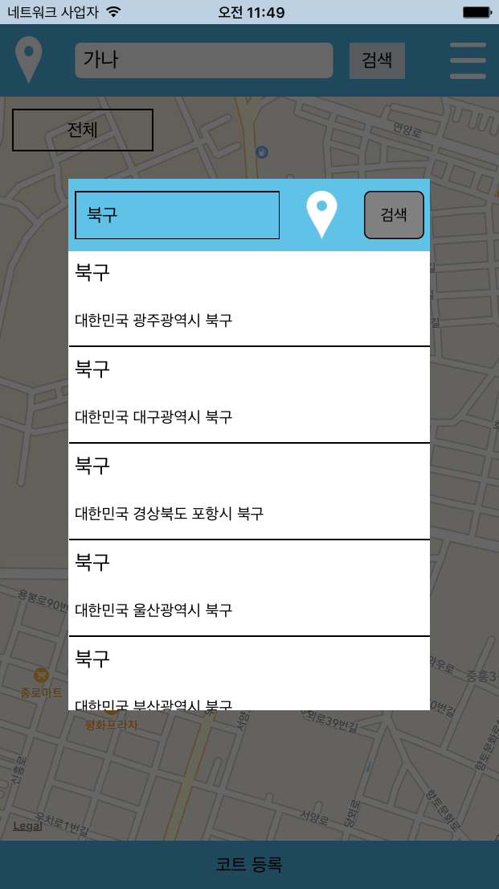

# Oyanggo
 

## Team
* smkim89(김성민), pikachu987(김관호)

## Schedule
* 전체 2016-05 ~
* IOS 2016-06 ~
* SERVER 2016-08 ~

## language
* Server - node.js
* IOS - Swift 2.2

## Server
* ImageServer
* ApiServer
* AdminServer

## IOS

#### cocoapods
* ImageSlideshow
* ActionKit
* RealmSwift
* InputTag
* Alamofire
#### sdk
* kakao

## Android

#### ....

## github commit
* 2016-07-06 initial commit
* 2016-07-24 IOS Alamofire로 통신하기 추가
* 2016-07-30 Server c9 node 이미지서버 추가

## 기능
* 사용자가 직접 코트 등록하기
* 코트 검색하기
* 코트근처/찜한사람 호출하기
* 호출이 되었을때 승낙/거부하기
* 승낙되면 답장받기

## 추후 업데이트 예정
* 운동 동호회 추가
* 코트장 스케쥴 추가

# IOS Image
> (디자인 필요... 개발자의 디자인이란....)

### 메인 

 
### 카테고리 설정 

 
### 위치 설정 

 
### 네비게이션 

 
### 코트검색 

 
### 해당코트상세보기(솜블리) 

 
### 코트약도보기 

 
### 로그인 

 
### 회원가입 

 
### 마이페이지 

 
### 회원수정 

 
### 앱정보 

 
### 앱설정 

 
### 코트등록하기 

 
### 이미지크롭하기 

 

             
### 디자인....허접하군....
